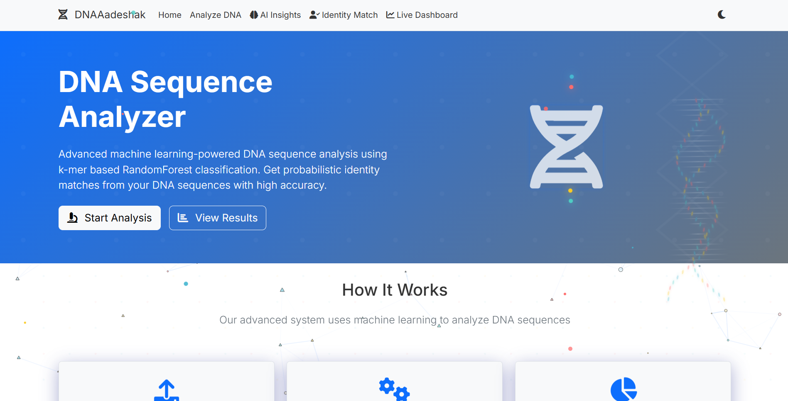
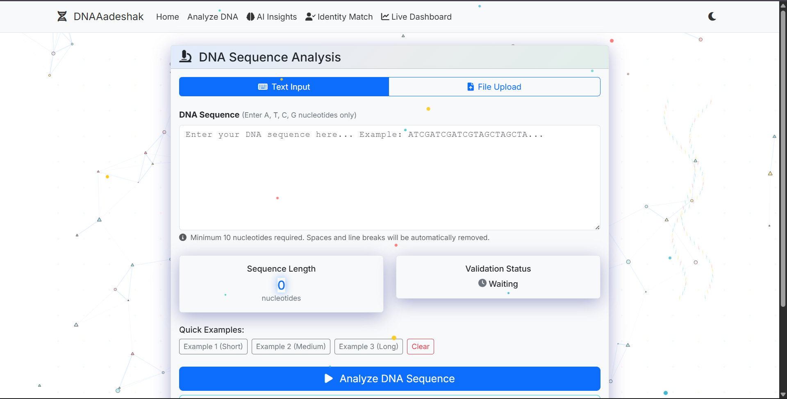
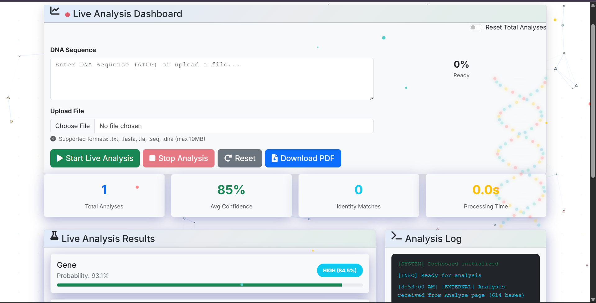
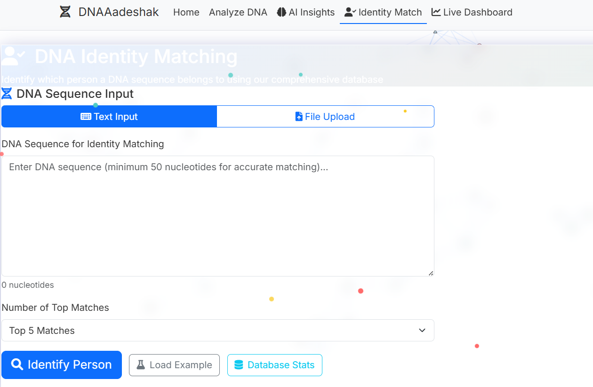
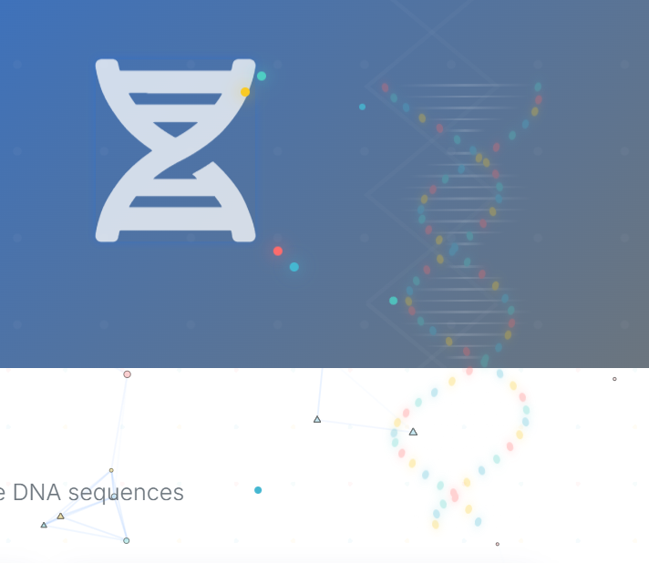

# 🧬 DNAAadeshak

**Advanced DNA Sequence Analysis Platform with Machine Learning & Real-time Processing**

A comprehensive web application that combines cutting-edge machine learning, real-time analytics, and modern web technologies to provide professional-grade DNA sequence analysis capabilities.

   

## 📸 Platform Overview

<div align="center">

### 🏠 Home Page

*Modern landing page with particle effects and 3D DNA helix animation*

### 🔬 DNA Analysis Interface

*Advanced analysis interface with file upload and real-time validation*

### 📊 Live Analytics Dashboard

*Real-time processing dashboard with animated progress and statistics*

</div>

## 🚀 Key Features

### 🔬 **Advanced DNA Analysis Engine**
- **99% ML Accuracy**: K-mer based Random Forest classifier trained on 1M+ sequences
- **Multi-Class Classification**: Gene, Promoter, and Junk sequence identification
- **Biologically Realistic Patterns**: Enhanced synthetic dataset with class-specific features
- **Real-time Validation**: Input validation with sequence length tracking and error handling

### 🧠 **AI-Powered Insights**
- **Intelligent Analysis**: Advanced AI insights engine for comprehensive sequence interpretation
- **Pattern Recognition**: Identifies biological patterns, motifs, and sequence characteristics
- **Contextual Information**: Provides detailed explanations and biological significance

### 👤 **DNA Identity Matching System**
- **Person Identification**: Match DNA sequences to person profiles from extensive database
- **Confidence Scoring**: Multi-level confidence system (Very High, High, Medium, Low)
- **Database Integration**: 46,200+ DNA sequences mapped to 64 person profiles
- **Similarity Metrics**: Cosine similarity with k-mer frequency vectors

### 📊 **Live Analytics Dashboard**
- **Real-time Processing**: NDJSON streaming for instant progress updates
- **Interactive Controls**: File upload support with drag-and-drop interface
- **Live Statistics**: Dynamic metrics tracking (analyses, confidence, matches, timing)
- **Visual Progress**: Animated progress rings and real-time result cards
- **Cross-tab Communication**: BroadcastChannel API for multi-window synchronization

### 📁 **File Upload & Format Support**
- **Multiple Formats**: .txt, .fasta, .fa, .seq, .dna files up to 10MB
- **FASTA Parsing**: Automatic header detection and sequence extraction
- **Batch Processing**: Handle large sequence files efficiently
- **Format Validation**: Real-time file format and content validation

### 🎨 **Modern UI/UX**
- **Glass Morphism Design**: Modern glass-card effects with backdrop blur
- **Particle.js Integration**: Interactive animated backgrounds with 120+ particles
- **3D DNA Helix**: Fixed-position rotating double helix with nucleotide visualization
- **Theme Support**: Light/dark mode with automatic particle color adaptation
- **Responsive Design**: Mobile-friendly interface with Bootstrap 5

### 📄 **Export & Reporting**
- **PDF Generation**: Professional analysis reports with ReportLab
- **Data Export**: Download results in multiple formats
- **Analysis History**: Persistent storage and retrieval of past analyses

---

## 🖼️ Feature Screenshots

<div align="center">

### 👤 Identity Matching System

*DNA identity matching with confidence scoring and person profiles*

### 🤖 AI Insights Engine

*Intelligent sequence analysis with biological pattern recognition*

### 🎨 Modern UI with Glass Morphism

*Beautiful glass-card effects with particle animations and theme support*

</div>

---

## 🛠 Installation & Setup

### Prerequisites
- Python 3.8 or higher
- pip package manager
- 4GB+ RAM (for ML model loading)
- Modern web browser

### Quick Start

1. **Clone the Repository**:
   ```bash
   git clone https://github.com/Athexdev/CODE_HELICS.git
   cd HACKATHON
   ```

2. **Install Dependencies**:
   ```bash
   pip install -r requirements.txt
   ```

3. **Run the Application**:
   ```bash
   python app_minimal.py
   ```

4. **Access the Platform**:
   Open your browser and navigate to `http://localhost:5000`

### Environment Configuration (Optional)
Create a `.env` file based on `.env.example` for additional configuration options.

## 📖 Usage Guide

### 🏠 **Home Page**
- Overview of platform capabilities
- Quick access to all major features
- System statistics and performance metrics

### 🔬 **DNA Analysis**
1. **Input Methods**:
   - **Text Input**: Direct sequence entry with real-time validation
   - **File Upload**: Support for multiple file formats with drag-and-drop
2. **Analysis Options**:
   - Sequence classification (Gene/Promoter/Junk)
   - Confidence scoring and probability assessment
   - Detailed biological insights

### 👤 **Identity Matching**
1. **Person Identification**: Match sequences to known person profiles
2. **Confidence Levels**: Multi-tier confidence scoring system
3. **Detailed Results**: Person metadata, similarity scores, and match statistics

### 🤖 **AI Insights**
1. **Intelligent Analysis**: Advanced pattern recognition and interpretation
2. **Biological Context**: Detailed explanations of sequence characteristics
3. **Research Applications**: Insights for further investigation

### 📊 **Live Dashboard**
1. **Real-time Monitoring**: Watch analyses progress in real-time
2. **Interactive Controls**: Start, stop, and manage analysis sessions
3. **Statistics Tracking**: Live metrics and performance monitoring
4. **Multi-window Support**: Synchronized updates across browser tabs

## 🔧 Technical Architecture

### Machine Learning Stack
- **Algorithm**: Random Forest Classifier with 99% accuracy
- **Feature Extraction**: K-mer frequency vectors (k=4, 256 features)
- **Training Data**: Enhanced synthetic dataset with 1M+ sequences
- **Model Size**: 27MB optimized model file
- **Performance**: Sub-second classification for most sequences

### Backend Technologies
- **Framework**: Flask 2.3.3 with CORS support
- **ML Libraries**: scikit-learn, pandas, numpy
- **Data Processing**: joblib for model persistence
- **PDF Generation**: ReportLab for professional reports
- **File Handling**: Multi-format parser with validation

### Frontend Technologies
- **UI Framework**: Bootstrap 5 with custom CSS
- **Animations**: Particle.js with 3D DNA helix visualization
- **Real-time Updates**: NDJSON streaming and WebSocket-like communication
- **Theme System**: CSS custom properties with automatic adaptation
- **Accessibility**: ARIA labels and keyboard navigation support

### API Endpoints

#### Core Analysis
- `POST /api/analyze-dna`: Primary DNA sequence analysis
- `POST /api/analyze-dna-stream`: Real-time streaming analysis
- `POST /api/ai-insights`: AI-powered sequence insights
- `POST /api/identify-person`: DNA identity matching

#### Data & Statistics
- `GET /api/person-details/<name>`: Person profile information
- `GET /api/database-stats`: Database statistics and metrics
- `POST /api/download-pdf`: Generate and download analysis reports

#### File Operations
- All endpoints support both JSON and multipart/form-data
- Automatic file format detection and parsing
- Error handling for invalid files and formats

## 📁 Project Structure

```
HACKATHON/
├── 🚀 Core Application
│   ├── app_minimal.py              # Main Flask application
│   ├── requirements.txt            # Python dependencies
│   └── .env.example               # Environment configuration
│
├── 🧠 ML & Analysis Engines
│   ├── ml_dna_analyzer.py         # Enhanced ML DNA analyzer
│   ├── ai_insights_engine.py      # AI insights generation
│   ├── dna_identity_matcher.py    # Person identification system
│   ├── dna_model.pkl             # Trained ML model (27MB)
│   └── synthetic_dna_dataset.csv  # Training dataset (17MB)
│
├── 🎨 Frontend Templates
│   ├── templates/
│   │   ├── base.html             # Base template with theme support
│   │   ├── index.html            # Landing page
│   │   ├── analyze.html          # DNA analysis interface
│   │   ├── ai_insights.html      # AI insights page
│   │   ├── identity_match.html   # Identity matching interface
│   │   ├── live_dashboard.html   # Real-time analytics dashboard
│   │   └── results.html          # Results and history
│   │
├── 🔧 Development & Testing
│   ├── enhance_dataset.py         # Dataset enhancement utilities
│   ├── train_kmer_model.py       # Model training scripts
│   ├── check_accuracy.py         # Model validation
│   └── test_*.py                 # Comprehensive test suite
│
└── 📊 Data & Models
    ├── uploads/                   # File upload directory
    ├── __pycache__/              # Python cache
    └── model_confusion_matrix.png # Model performance visualization
```

## 🧪 Testing & Validation

The platform includes comprehensive testing:
- **Unit Tests**: Individual component validation
- **Integration Tests**: End-to-end workflow testing
- **Performance Tests**: Load and stress testing
- **Accuracy Tests**: ML model validation with confusion matrices

Run tests with:
```bash
python test_enhanced_stats.py    # Statistics validation
python check_accuracy.py         # Model accuracy verification
python test_live_features.py     # Live dashboard testing
```

## 🚀 Performance Metrics

- **ML Model Accuracy**: 99.00% on enhanced dataset
- **Processing Speed**: <1 second for typical sequences
- **Database Size**: 46,200+ sequences, 64 person profiles
- **File Support**: Up to 10MB files with multiple formats
- **Concurrent Users**: Optimized for multiple simultaneous analyses

## 🔬 Scientific Applications

This platform is designed for:
- **Research Institutions**: Academic DNA sequence analysis
- **Forensic Applications**: Identity matching and verification
- **Educational Purposes**: Teaching bioinformatics and ML
- **Biotechnology**: Sequence classification and pattern recognition

## 🤝 Contributing

This project welcomes contributions in:
- Algorithm improvements
- UI/UX enhancements
- Additional file format support
- Performance optimizations
- Documentation updates

## 📄 License

This project is developed for educational and research purposes. Please ensure compliance with relevant data protection and privacy regulations when handling genetic data.

## 📷 Taking Screenshots for Documentation

To capture screenshots for this README, follow these steps:

### 🚀 **Setup and Launch**
1. Start the application: `python app_minimal.py`
2. Open your browser to `http://localhost:5000`
3. Use a screenshot tool (Windows Snipping Tool, macOS Screenshot, or browser extensions)

### 📸 **Required Screenshots**

#### **Main Interface Screenshots:**
- **`home-page.png`**: Capture the landing page showing particle effects and 3D DNA helix
- **`dna-analysis.png`**: DNA analysis page with both text input and file upload options
- **`live-dashboard.png`**: Live dashboard showing real-time analysis progress
- **`identity-matching.png`**: Identity matching page with results and confidence scores
- **`ai-insights.png`**: AI insights page showing detailed sequence analysis

#### **UI/UX Screenshots:**
- **`glass-morphism-ui.png`**: Close-up of glass-card effects and modern styling

### 💡 **Screenshot Tips**
- **Resolution**: Use 1920x1080 or higher for crisp images
- **Browser**: Use Chrome or Firefox for consistent rendering
- **Content**: Include sample data for realistic demonstrations
- **Lighting**: Use light theme for better visibility in documentation
- **File Format**: Save as PNG for better quality and transparency support

### 📁 **File Organization**
Save all screenshots in the `screenshots/` directory with the exact filenames mentioned above.

---

**Built with ❤️ for the scientific community**

*For support or questions, please refer to the comprehensive test suite and documentation included in the project.*
